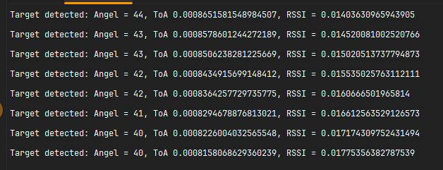
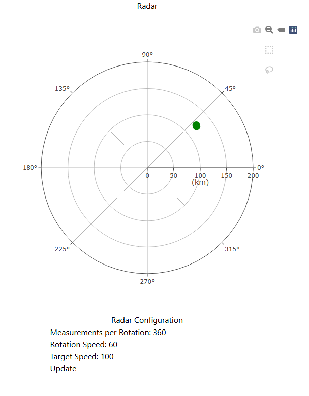
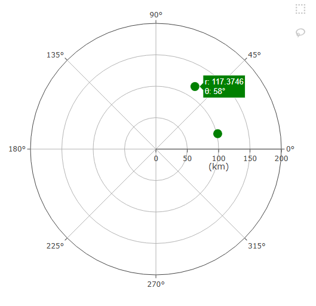
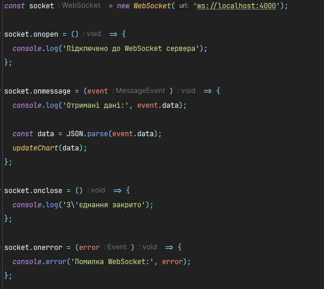
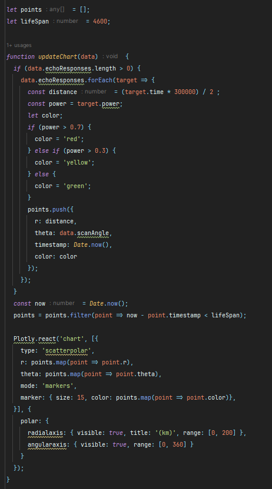
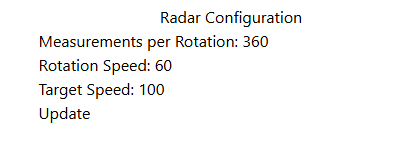
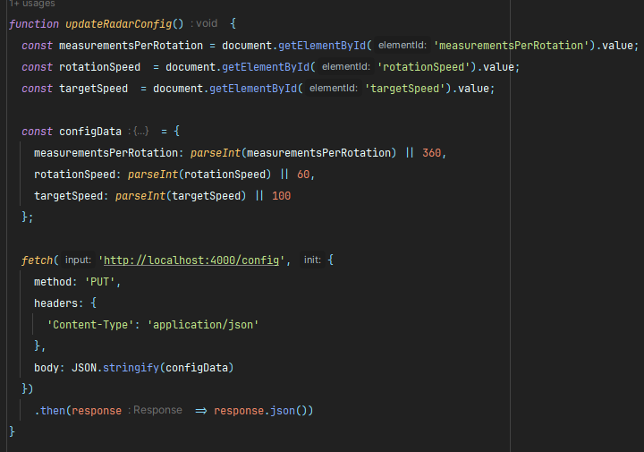

## Radar Lab

Емулятор вимірювальної частини радару надається у вигляді Docker image під назвою radar-emulation-service. Щоб запустити емулятор, виконайте наступні кроки:
1. Завантажте Docker image з Docker Hub:  
   ````
   docker pull iperekrestov/university:radar-emulation-service
   ````
2. Запустіть Docker контейнер, використовуючи наступну команду:
   ````
   docker run --name radar-emulator -p 4000:4000 iperekrestov/university:radar-emulation-service
   ````



Веб-додаток підключається до WebSocket сервера, зчитує дані про задетектовані цілі та відображає отримані дані на графіку в полярних координатах. Обробляє дані отримані через вебсокет і відображає їх на графіку.




Кожна ціль представлена як точка на графіку з координатами (кут, відстань).



Код:






Можливість зміни параметрів вимірювальної частини радара за допомогою API запитів.



